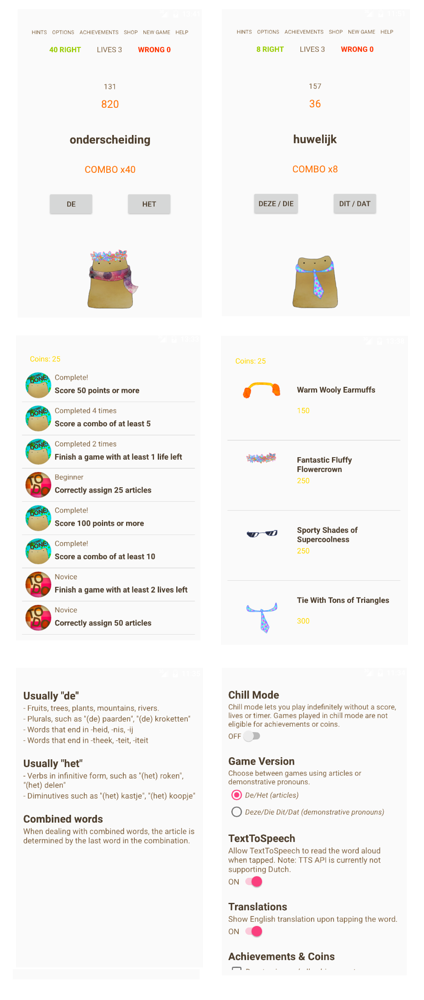

# DeHet

## Omschrijving

De App DeHet is een app waarmee gebruikers de combinaties van lidwoorden en zelfstandige naamwoorden kunnen oefenen. Omdat veel buitenlanders die Nederlands proberen te leren de lidwoorden lastig vinden kunnen ze met deze app door middel van veel herhaling en een toegevoegd spelelement oefenen. De app laat de gebruiker een woord zien waarna het bijbehorende lidwoord gekozen moet worden. Dit gaat gepaard met een timer, score en combofunctie, waardoor de gebruiker steeds weer uitgedaagd wordt om een hogere score te halen. Daarnaast maakt de app ook gebruik van een woordenboek met vertalingen, waardoor de gebruiker de Engelse vertaling van een woord te zien krijgt als hij of zij op het woord tapt. Ook worden woorden die fout worden gedaan nogmaals in de lijst gestopt, waardoor de kans dat de gebruiker een fout woord nogmaals tegenkomt vergroot wordt. Goed geraden woorden worden juist uit de lijst verwijderd. Naast een spelversie met score, levens, achievements en timer is er ook een "chill" versie waarbij al deze dingen ontbreken en de gebruiker gewoon op eigen tempo de woorden kan doorlopen. Tot slot is er naast een lidwoorden versie ook een aanwijzende voornaamwoord versie, waarbij de de/het knoppen worden vervangen door die/deze dit/dat knoppen. Om het spel wat leuker en minder droog te maken kan met het behalen van achievements een bepaalde hoeveelheid coins verdiend worden, welke gebruikt kunnen worden in de shop. In de shop kunnen items gekocht worden om de mascotte van het spel, Bruin, mee aan te kleden. Hierdoor krijgen de achievements ook na het eenmaal behalen nog een functie en kan de gebruiker ook zelf doelen stellen, naast het verbeteren van de beheersing van de lidwoorden.

## Screenshots

## Data Sources
### Dictionary
http://www.dicts.info

### Code hulp
http://codehenge.net/blog/2011/05/customizing-android-listview-item-layout/
http://android-developers.blogspot.nl/2009/02/android-layout-tricks-1.html
http://stackoverflow.com/questions/3280141/calledfromwrongthreadexception-only-the-original-thread-that-created-a-view-hie
http://stackoverflow.com/questions/14393423/how-to-make-a-countdown-timer-in-java

## Licentie
DeHet © by Renske Talsma
App is alleen voor persoonlijk gebruik.
Dictionary © www.dicts.info

 