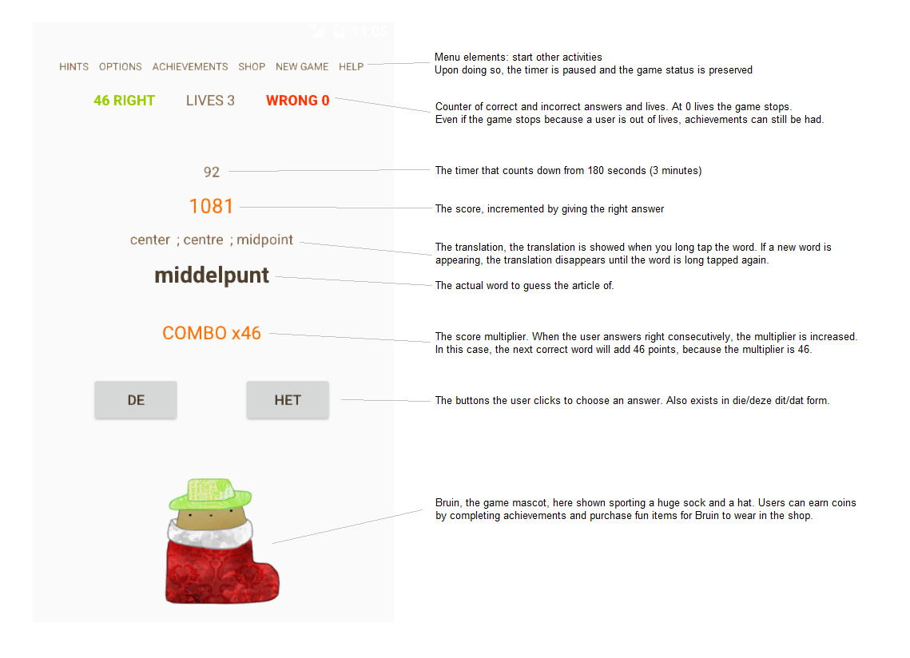

# Final Report
Renske Talsma
10896503

## Introduction
De App DeHet is een app waarmee gebruikers de combinaties van lidwoorden en zelfstandige naamwoorden kunnen oefenen. Omdat veel buitenlanders die Nederlands proberen te leren de lidwoorden lastig vinden kunnen ze met deze app door middel van veel herhaling en een toegevoegd spelelement oefenen. De app laat de gebruiker een woord zien waarna het bijbehorende lidwoord gekozen moet worden. Dit gaat gepaard met een timer, score en combofunctie, waardoor de gebruiker steeds weer uitgedaagd wordt om een hogere score te halen. Daarnaast maakt de app ook gebruik van een woordenboek met vertalingen, waardoor de gebruiker de Engelse vertaling van een woord te zien krijgt als hij of zij op het woord tapt. Ook worden woorden die fout worden gedaan nogmaals in de lijst gestopt, waardoor de kans dat de gebruiker een fout woord nogmaals tegenkomt vergroot wordt. Goed geraden woorden worden juist uit de lijst verwijderd. Naast een spelversie met score, levens, achievements en timer is er ook een "chill" versie waarbij al deze dingen ontbreken en de gebruiker gewoon op eigen tempo de woorden kan doorlopen. Tot slot is er naast een lidwoorden versie ook een aanwijzende voornaamwoord versie, waarbij de de/het knoppen worden vervangen door die/deze dit/dat knoppen.
Om het spel wat leuker en minder droog te maken kan met het behalen van achievements een bepaalde hoeveelheid coins verdiend worden, welke gebruikt kunnen worden in de shop. In de shop kunnen items gekocht worden om de mascotte van het spel, Bruin, mee aan te kleden. Hierdoor krijgen de achievements ook na het eenmaal behalen nog een functie en kan de gebruiker ook zelf doelen stellen, naast het verbeteren van de beheersing van de lidwoorden.

## Technical Design
De code is verdeeld over verschillened Activities en Classes.

###Activities
* MainActivity: hier vindt het eigenlijke spel plaats
* AchievementsActivity: bevat een listview met alle achievements van het spel
* HintsActivity: bevat hints om er achter te komen welke woorden de of het gebruiken
* HelpActivity: bevat een korte tutorial en uitleg over de werking van de app
* ShopActivity: bevat de shop waar de gebruiker items kan kopen en equippen
* OptionsActivity: bevat de opties van het spel

### Classes
* Dictionary
De dictionary klasse laadt door middel van XML parsing een woordenboek in uit een XML bestand. Dit woordenboek wordt in de app gebruikt om zowel de Nederlandse combinaties van lidwoorden en zelfstandige naamwoorden te kiezen, maar ook om de vertaling te kunnen tonen.
Het woordenboek wordt opgeslagen in een map met String, String format. Van de keys van het woordenboek wordt een lijst gemaakt, zodat hieruit gemakkelijk pseudorandom een woord gekozen kan worden. 

* GamePlay
Gameplay houdt zich bezig met het echte spel. In deze class zitten de meeste methods en gebeurt ook het meest.

* Stopwatch
De stopwatch class is puur de implementatie van de timer, welke gebruikt wordt in gameplay.

* ShopLoader & AchievementLoader
Zowel shoploader als achievementloader zorgen dat de listviews in respectievelijk de shop- en achievementactivity de juiste items uit SharedPreferences krijgen en omgezet worden van Gson naar een array en andersom. Ook maken deze classes de items opnieuw aan als er geen opgeslagen versies van zijn, bijvoorbeeld als de app voor het eerst wordt opgestart of de gebruiker een reset heeft doorgevoerd.

* Bruin
Bevat alle ImageViews die te maken hebben met de mascotte Bruin en zorgt ervoor dat de juiste informatie uit de shop wordt opgehaald.

* Achievement
Bevat informatie over de naam van het achievement, de status (compleet of incompleet), de hoeveelheid keer dat de gebruiker hem herhaald heeft en de moeilijkheidsgraad.

* ShopItem 
Bevat informatie over de prijs van een item, het uiterlijk, of de gebruiker het item in bezit heeft of niet en of de gebruiker het item equipped heeft of niet.

In de onderstaande schema's is te zien welke methods er in welke class zitten, welke argumenten deze vereisen en wat ze returnen.

### Verdeling van methods over activities

TODO

## App design

Het hoofdscherm van de app (MainActivity) ziet er als volgt uit in normal game mode:

Het hints en opties scherm (HintsActivity en OptionsActivity) kunnen via het menu worden bereikt. In het hints scherm staan een aantal suggesties om de gebruiker op weg te helpen bij het leren van de lidwoorden.
De opties geven de gebruiker de mogelijkheid om te kiezen voor chill mode, een mode waarbij de score, achievements, timer en levens niet van belang zijn maar de gebruiker rustig kan oefenen.
Ook kan de gebruiker er voor kiezen om vertalingen of TextToSpeech uit te zetten. Tot slot is er ook een functie om de achievements en coins te resetten, voor als iemand weer opnieuw wil beginnen met achievements. 

Als de chill mode actief is, worden alle layoutelementen die niet van belang zijn verborgen. Chill mode kan ook met die/deze dit/dat geactiveerd worden. De mascotte is nog wel gewoon actief.

In de ShopActivity kunnen accessories voor de mascotte Bruin gekocht worden:

## Challenges
Tijdens het maken van de app zijn er verschillende dingen waar ik tegen aan liep. Het eerste was het inladen van het woordenboek. Dit moest middels een XML parser gebeuren, maar ik had tot dan toe nog nooit gebruikt gemaakt van XML parsing en het woordenboek had ook vreemde, nested tags waardoor ik de vertaling in eerste instantie niet kon bereiken. Gelukkig konden de gewone woorden wel ingeladen worden en daar heb ik me dus eerst op gefocust. Uiteindelijk heb ik besloten om de XML zelf aan te passen in plaats van omslachtig bezig te zijn met de parser. Met find en replace heb ik de tags zodanig aangepast dat de tags wel ingelezen konden worden door de parser. Op die manier heb ik ook de vertaling toegevoegd.

Een andere challenge was TextToSpeech. Hoewel het implementeren hiervan niet extreem lastig was, ben ik hier wel vrij lang mee bezig geweest, omdat ik uit alle macht probeerde om ergens een Nederlandse ondersteuning vandaan te krijgen of te downloaden via de API. Helaas bleek naar veel googlen dat de API van android's TextToSpeech nu eenmaal geen Nederlands ondersteunt, ook niet deels, en dat mijn TextToSpeech dus eigenlijk nutteloos was. Ik heb besloten de code wel in de app te laten, omdat op het moment dat android er wel support voor toevoegt alles per direct zou moeten werken. Hoewel het geen deel uitmaakte van mijn oorspronkelijke design, vond ik het namelijk wel een nuttige toevoeging. De TextToSpeech staat echter wel uitgeschakeld maar kan via de opties aan gezet worden. Er staat dan wel bij vermeld dat Nederlands op dit moment nog niet ondersteund wordt.

Tot slot heb ik ook veel problemen gehad met de timer in het spel. Oorspronkelijk maakte ik gebruik van android's eigen CountDownTimer class. Dit ging prima en ik had er verder totaal geen problemen mee, totdat ik de timer zodanig wilde instellen dat deze pauzeerde als de gebruiker naar achievements, de shop of een ander scherm ging, en de tijd weer oppakte als de gebruiker terug kwam in het hoofdscherm. Het opslaan van de tijd op het moment van pauze en hervatten waren geen probleem, maar op één of andere manier werkte het cancellen van de huidig lopende timer totaal niet, waardoor je na het verlaten en terugkomen in de hoofdactivity met twee door elkaar lopende timers zat. Ik heb hier veel op gegoogled en het bleek dat meerdere mensen het probleem hadden dat de ingebouwde cancel() method niet werkte. Ik heb toen met wat boolean toestanden geprobeerd extra voorwaarden te stellen voor het doorgaan van de timer (in de onPause timerstatus op false zetten en stellen dat de timer alleen mag doortikken als de status true is), maar ook deze werden genegeerd. Omdat de timer wel vrij essentieel was voor mijn spel heb ik toen besloten om op zoek te gaan naar een manier om een eigen timer te implementeren. Ik heb een goede uitleg gevonden en met behulp van deze uitleg een eigen stopwatch klasse gemaakt welke gebruikt maakt van TimerTask in plaats van CountDownTimer. Deze werkt wel en laat zich ook netjes pauzeren en hervatten. Al met al ben ik hier echt wel lang mee bezig geweest, in de tweede week had ik al problemen met de timer en uiteindelijk is het past na een week ongeveer opgelost. Het laatste probleempje met de timer was dat ik een method uit GamePlay wilde aanroepen vanuit de Stopwatch class, maar zonder een instantie van GamePlay aan te maken in Stopwatch. Marvin heeft me toen erg geholpen met het maken van een interface klasse waardoor de timer toch netjes doorsprong naar de onWin method in GamePlay als deze 0 seconden bereikte. Al met al is de timer dus het element geweest dat me de meeste problemen heeft opgeleverd, maar het is allemaal goed gekomen.

Naast deze meer specifieke problemen heb ik ook een beetje last gehad van mijn gebrek aan kennis over fragments. Op dit moment heb ik in mijn app diverse schermen, maar deze zijn allemaal van het type activity. Dit is voor sommige schermen niet echt nodig omdat er eigenlijk alleen maar tekst getoond wordt, bijvoorbeeld. Zoiets had dan beter in een fragment gekund. Tot aan de derde week had ik echter nog nooit van fragments gehoord en was het voor mij dus ook niet te doen om dat dan nog te implementeren. Als ik verder ga werken aan deze app ben ik wel van plan om te kijken of ik het wat handiger aan kan pakken, omdat het vermoedelijk ook een stuk sneller is.

In vergelijkin met mijn originele design zitten de meeste functionaliteiten van de app in het eindproduct, maar de verdeling/indeling van methods over de classes is wel veranderd. Ik vind het nog steeds lastig om van te voren te bedenken welke classes er allemaal moeten komen en hoe die zich tot elkaar verhouden, omdat in de praktijk vaak blijkt dat het moeilijk is om bepaalde dingen buiten de activity zelf te doen. Meestal maak ik eerst alles in één bestand en ga ik dan pas kijken hoe het eventueel op te splitsen is. Dit is met deze app ook gebeurd, hoewel ik een designdoc had met een verdeling over classes stond in het begin 90% van de code gewoon in MainActivity. Vaak vind ik het lastig om het op te splitsen omdat bepaalde dingen die bijvoorbeeld met layoutcomponenten van de originele activity te maken hebben niet meer werken, omdat ze niet over de juiste context beschikken. Inmiddels kom ik er meestal wel uit, maar ik blijf dat toch moeilijk vinden. Ook bijvoorbeeld dingen als ListViewAdapters verplaats ik niet zo snel uit de Activity zelf, omdat ik geen idee heb hoe ik zoiets weer goed werkend krijg in een aparte class. Dit geldt bijvoorbeeld ook voor (onclick)listeners. Voor mijzelf wordt het er vaak niet overzichtelijker van als ik een deel wel verplaats naar een class maar een ander deel niet, dus kies ik er dan vaak voor alles maar bij elkaar te laten staan. 